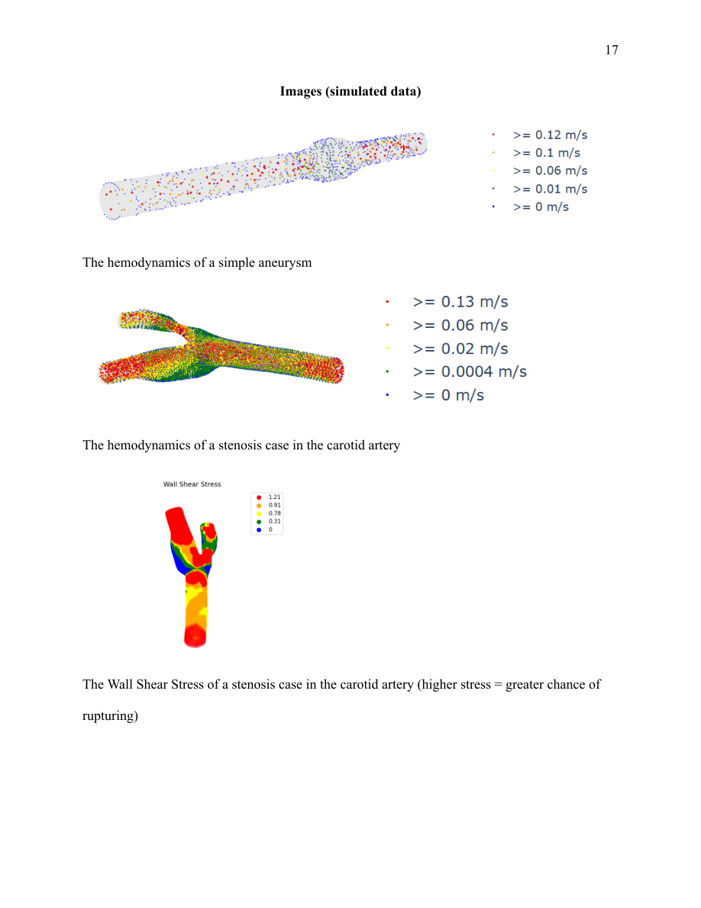

# HemoViz3D Web

An interactive web application for visualizing CFD-derived blood flow in cerebral aneurysms and carotid stenosis. It combines vascular geometry with velocity and wall shear stress data so that users can rotate a model, inspect local patterns, and view changes over time.

**Research Year 1 · Python · Flask · Plotly**  
[Research paper, 2023–24 (PDF)](papers/science-research-2023-24.pdf) · [Published article](https://doi.org/10.36838/v7i5.27)

*Examples reproduced from page 17 of the 2023–24 paper. The colors display hemodynamic quantities; they are not a validated rupture-risk score.*

## Why I built it

CFD produces quantitative blood flow data, but inspecting that data requires tools that can show both the vessel and the flow within it. I developed HemoViz3D to bring those plots into an interactive browser interface. The work began with a Tkinter/Matplotlib desktop prototype and developed into a Flask application with Plotly visualizations.

## My contributions

- Processed tabular CFD exports and combined their spatial coordinates with STL vessel geometry.
- Built input forms and rendering routes for velocity vectors, scatter plots, and wall shear stress.
- Added color scales and plot controls for examining different parts of a vessel.
- Created animations from multiple time points, including 2D video generation and interactive 3D plots.

The web research was conducted with mentorship from Dr. Venkat Keshav Chivukula at Florida Institute of Technology. Flask, Plotly, Matplotlib, and the other libraries provide the underlying web and plotting components.

## Using the application

[Using the application](USING_THE_APPLICATION.md) describes the application files and how to use them.

## Research papers

- [2023–24: Web visualization (PDF)](papers/science-research-2023-24.pdf)
- [2024–25: Virtual reality visualization (PDF)](papers/science-research-2024-25.pdf)
- [2025–26: Aneurysm detection and rupture modeling (PDF)](papers/science-research-2025-26.pdf)

For citation: Eshan Vipuil. “HemoViz3D: A Novel Open-Source Web Application for Visualization of Blood Flow Dynamics in Cerebral Aneurysms.” *International Journal of High School Research* (2025). [doi:10.36838/v7i5.27](https://doi.org/10.36838/v7i5.27).

The papers describe research prototypes. Visualization results alone do not establish diagnostic accuracy or clinical benefit.

