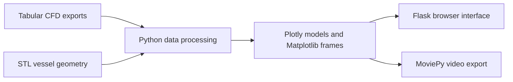

# Using the application

## How it works



`finalapp.py` contains the Flask routes and plotting code. `templates/` contains the input forms and output pages; `static/` includes example images. `angular/` is a separate frontend directory and is not required to run the Flask entry point.

## Run locally

The paper used Python 3.11. Create and activate a virtual environment, then install the libraries imported by the application:

```bash
python -m pip install flask numpy pandas plotly matplotlib scikit-learn numpy-stl "moviepy<2"
python -m flask --app finalapp run
```

Open `http://127.0.0.1:5000`. MoviePy 1.x is specified because the code imports `moviepy.editor`; video generation also needs an FFmpeg installation available to MoviePy. This dependency set is derived from the source and is not a locked environment.

The repository includes preset routes and example geometry. Custom files must match the column selections and formatting expected by the input forms. The current application uses shared in-memory state and a development configuration; this snapshot is intended for local research use.

